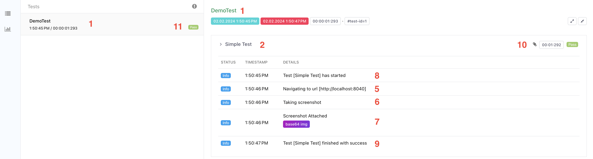
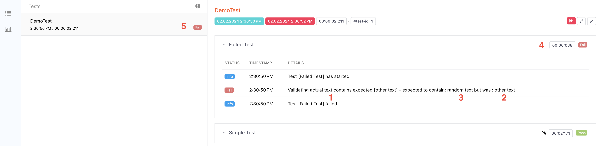

# pFrame


## What is pFrame?
pFrame is the culmination of years of experience working in the IT industry
as a QA. It is a wrapper framework that aims to remove the time for setting
up your framework and provide an easy-to-use library for writing tests.

### Core
Integrates the 4 major components that any framework should have:
* Test running: [TestNG](https://testng.org/)
* Reporting: [Extent Reports](https://www.extentreports.com/)
* Logging: [Apache Log4j](https://logging.apache.org/log4j/2.x/)
* Assertions: [Truth](https://truth.dev/)

No matter that you have a UI, API, DB or any type of application, this
framework gives you the tools to create tests while not limiting you to a
specific technology. Selenium, Rest Assured etc. can be easily integrated
with pFrame.

## How to use it?
### Install
pFrame can be added as a dependency using jitpack.io repository.

```
    <repositories>
        <repository>
            <id>jitpack.io</id>
            <url>https://jitpack.io</url>
        </repository>
    </repositories>

    <dependencies>
        <dependency>
            <groupId>com.github.iulian1307</groupId>
            <artifactId>pframe-core</artifactId>
            <version>${pframe.version}</version>
        </dependency>
    </dependencies>
```

### Running tests
In order  to run pFrame you need to use the TestNG listener where all the
components are integrated. PFrameListener can be set in:
- Suite.xml
```
<suite name="demo-suite">
    <listeners>
        <listener class-name="com.qaitsolutions.pframe.core.testng.PFrameListener"/>
    </listeners>
```

- Listeners annotation on the test class
```
@Listeners(PFrameListener.class)
public class DemoTest {
```

Once the listener is configured and the tests run, a report will be generated in 
target/extent-reports directory.

### Reporting
By default, the report location is target/extent-reports/index.html

#### Let's consider a successful test:
```
@Listeners(PFrameListener.class)
public class DemoTest { //(1)

    @Test(description = "Simple Test") //(2)
    public void simpleTest() { 
    
        Log.debug("Configuring Driver"); //(3)
        var homeUrl = "http://localhost:8040";
        new DriverBuilder().fromConfigFile().build();

        Log.info("Navigating to url [%s]", homeUrl); //(5)
        Driver.getDriver().navigate().to(homeUrl);

        Log.info("Taking screenshot"); //(6)
        var screenshotBase64 = ((TakesScreenshot) Driver.getDriver()).getScreenshotAs(OutputType.BASE64);
        Log.infoWithScreenshotByBase64String("Screenshot Attached", screenshotBase64); //(7)

        Log.debug("Closing Driver"); //(4)
        Driver.getDriver().quit();
    }
}
```

The report will show:


<p>(1) The test name will be taken from the class name.
<p>(2) The node  (sub-test) name will be taken from description in the @Test annotation.
If the annotation doesn't have a description, the method will be used as name.
<p>(3)(4) Log.debug() will log into the debug.log file and on the console but not in the report
<p>(5)(6) Log.info() will log in all three logging methods (report, file, console)
<p>(7) Log.infoWithScreenshotByBase64String() attaches an image to the report.
<p>(8) Is logged automatically at the start of each test
<p>(9) Is logged automatically at the end of each successful test
<p>(10) The test is successful, because no failure/warn occurred in the runtime
<p>(11) The test is successful, because no failure/warn occurred in the sub-tests


#### Let's consider a failed test:
```
    @Test(description = "Failed Test")
    public void failedTest() {
        var actual = "random text";
        var expected = "other text";

        var assertion = new Assertions();
        assertion.assertWithMessage("Validating actual text contains expected [%s]", expected) //(1)
                .assertThat(expected) //(2)
                .contains(actual); //(3)
    }
```

The report will show:


<p>(1)(2)(3) The assertion logs a message and in case of a failure the expected and
actual values. In case the assertion doesn't fail the actual and expected are not logged.
<p>(4) The test is failed, because a failure (and error) has happened in the test;
<p>(5) The test is failed, because one sub-test has failed;

### Logging
<p>pFrame offers a central logger in order to log in the report, file and console. Separate from the 
report, a logfile is created in target/extent-reports/debug.log

Here is the full API: [Log javadoc](https://iulian1307.github.io/pframe-core/com/qaitsolutions/pframe/core/logging/Log.html)

Here are some examples:

```
//Logs in log file (debug.log), console but not the report
Log.debug("Pretest check");
```


```
//Logs in log file, console and report
Log.info("Opening some page"); 
```

```
//Logs in log file, console and report.
//Changes test status to warning in report
Log.warn("This test might fail"); 
```

```
//Logs in log file, console and report.
//Changes test status to pass in report
//Recommend using Assertions instead of Log.pass()
Log.pass("No, it went just fine :)");
```

```
//Logs in log file, console and report.
//Changes test status to fail in report only if an AssertionError is triggered
//Recommend using Assertions instead of Log.pass()
Log.fail("Actually, it failed :(");
```

```
//Logs in report only
Log.infoWithScreenshotByBase64String("Attached screenshot", base64String);
Log.infoWithScreenshotByPath("Attached screenshot", pathToFile); //i.e. screenshots/screenshot.png
Log.infoWithXml(xmlString);
Log.infoWithJson(jsonString);
```

### Assertions
The assertions are integrated with the log/console/report, meaning that
any validation done will also be displayed in the aforementioned systems.
The assertion will take a type (String, int, List etc.) and return
existing validation methods for that specific type.

#### Regular assertions
Regular assertions will throw AssertionError if the assertion fails. This is
useful for small test cases that require a single validation.

```
//String assertion example
var assertion = new Assertions();
var expected = "string";
var actual = "expected string";

var message = "Validating that expected value [%s] is present in actual values [%s]";

assertion.assertWithMessage(message, expected, actual)
        .assertThat(actual)
        .contains(expected);
```

```
//Integer assertion example
var assertion = new Assertions();
var expected = 20;
var actual = 100;

var message = "Validating that actual value [%s] is less than [%s]";

assertion.assertWithMessage(message, expected, actual)
        .assertThat(actual)
        .isLessThan(expected);
```

```
//Map assertion example
var assertion = new Assertions();
var actual = Map.of("key1", "value1");
var expectedSize = 2;

var message = "Validating that map [%s] has size [%s]";

assertion.assertWithMessage(message, actual, expectedSize)
        .assertThat(actual)
        .hasSize(expectedSize);
```

Here is the full Assertions API: [Assertions javadoc](https://iulian1307.github.io/pframe-core/com/qaitsolutions/pframe/core/assertion/Assertions.html)

#### Soft assertions
Soft assertions are useful for more complex validation. For example,
having a web page with a form, or an api response with multiple values,
can be tested by validating multiple values before triggering the actual
validation. In the case multiple values are not correct, the test will
not stop on the first incorrect values, and thus hiding other defect.

```
//Soft assertion example
var assertion = new SoftAssertions();

var name = "Frank";

var human = new HumanDTO();
human.setName(name);
human.setAge(28);
human.setGender("Male");

var expectedAge = 32;
var expectedGender = "Female";

assertion.assertWithMessage("Validating that human has name [%s]", name)
        .assertThat(human.getName())
        .isEqualTo(name);

assertion.assertWithMessage("Validating that human has age [%s]", expectedAge)
        .assertThat(human.getAge())
        .isEqualTo(expectedAge);

assertion.assertWithMessage("Validating that human has gender [%s]", expectedGender)
        .assertThat(human.getGender())
        .isEqualTo(expectedGender);

//Always use this method in order to trigger the validation.
assertion.assertAll();
```

Here is the full SoftAssertions API: [SoftAssertions javadoc](https://iulian1307.github.io/pframe-core/com/qaitsolutions/pframe/core/assertion/SoftAssertions.html)


### Javadoc
The complete javadoc can be found [here](https://iulian1307.github.io/pframe-core/).

## Configurable parameters

```
-Dreport.path=target/extent-reports/
```
report.path - This will set the location of the report file, but not the log file. Default
value is *target/extent-reports/*.

```
-Dreport.type=single
```
report.type - This will generate either a single index.html file for each run
(single), or generate a new html file for each run (multi). The default value
is "single".

## Contributing
Contributions to pFrame are both welcomed and appreciated.
Feel free to fork, clone, build, run tests and contribute pull requests for pFrame!

## Authors
pFrame was designed and developed by [Iulian Andrei](https://github.com/iulian1307). This 
framework is the result of years of working in the IT industry as a QA.

## Thanks
Many thanks to these incredible tools that help us and inspired us to create open-source software:


## License
pFrame is an open-source project.